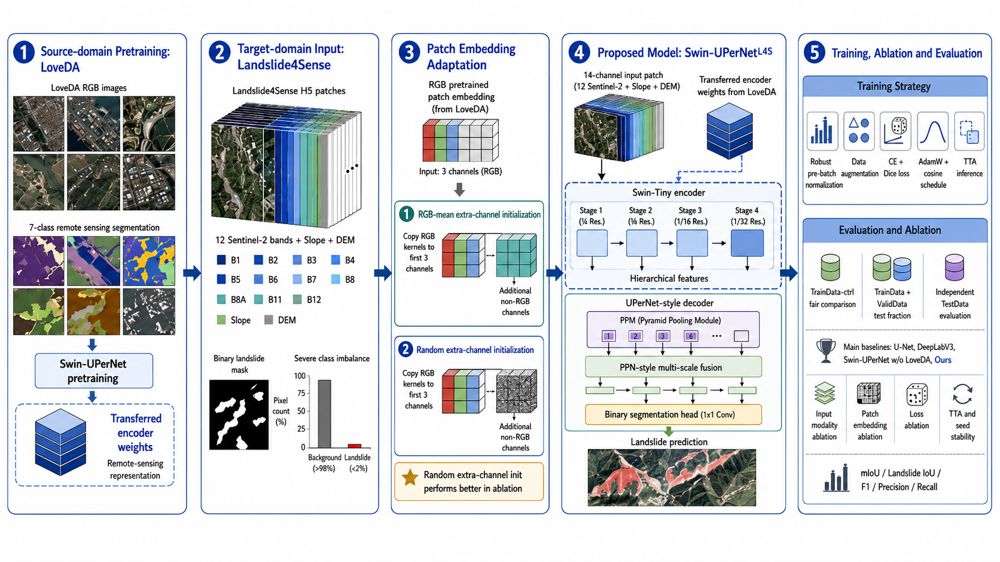
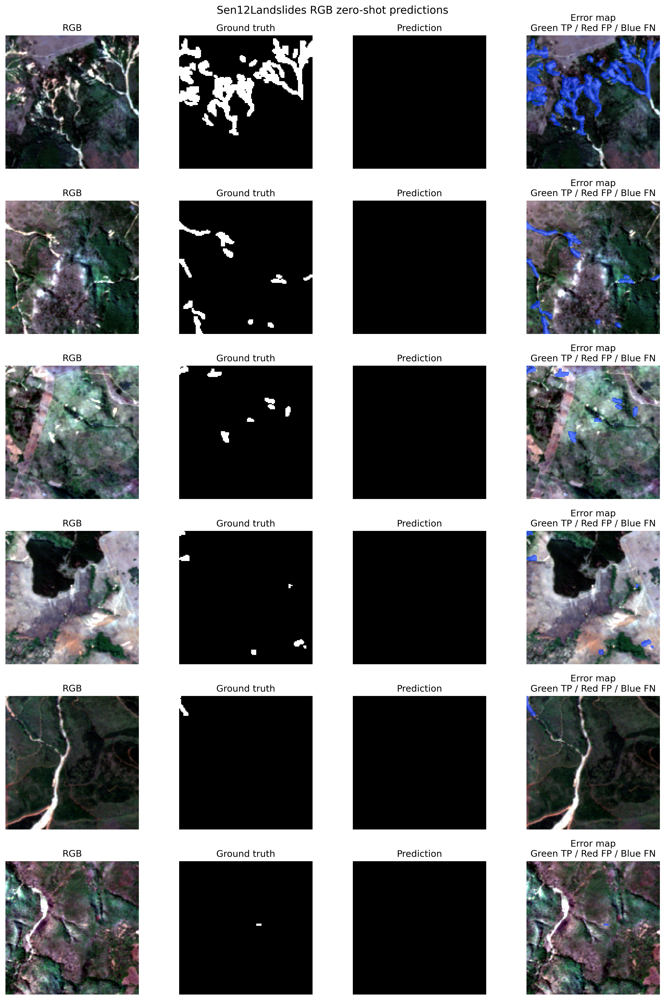
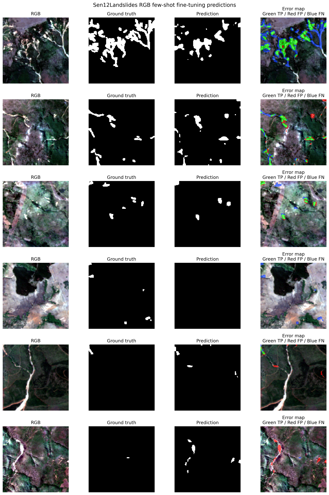

# Geological Paper Code (地质论文代码)

This repository contains code and figures for our geological paper experiments.  
（本仓库包含地质论文实验的代码和图表。）

  
（总体实验流程图）

## Prediction Examples on SEN12-RGB (SEN12-RGB 数据集上的预测示例)

We also evaluate our model on the external SEN12-RGB dataset under zero-shot and few-shot settings. Below are example predictions.  
（我们还在外部 SEN12-RGB 数据集上评估了模型在零样本和少样本设置下的表现。以下是部分预测结果。）

### Zero-Shot Predictions (零样本预测)

### Few-Shot (50 shots) Predictions (少样本（50张）预测)

