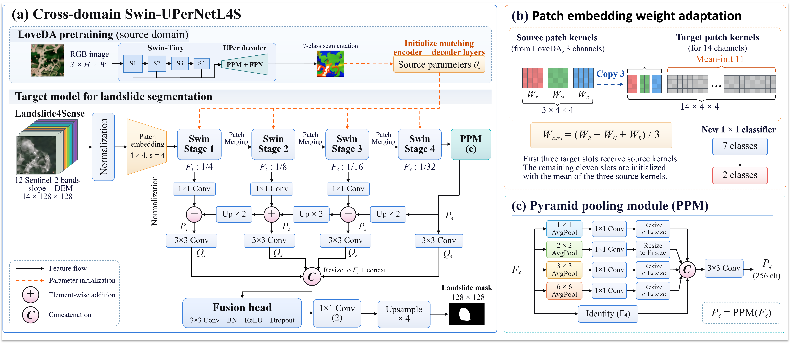

# LoveDA → Landslide4Sense: landslide segmentation

Research code for cross-domain remote sensing pretraining with Swin-UPerNet. LoveDA supplies source-domain land-cover supervision; Landslide4Sense supplies multispectral and topographic landslide labels.

**Start here:** [Reproduce results](docs/REPRODUCE.md) · [Experimental protocol and limitations](docs/EXPERIMENT_PROTOCOL.md) · [Artifact status](docs/ARTIFACT_STATUS.md)

## Evidence status

The retained final model reports landslide IoU **0.4793**, F1 **0.6480**, precision **0.6357**, recall **0.6609**, and mIoU **0.7328** on benchmark TestData after TrainData + ValidData training. This is a reproducible benchmark result, not a state-of-the-art claim. Historical test-informed candidate comparisons limit claims of untouched test evaluation.

TrainData-only Swin-UPerNet scores are 0.3916 without LoveDA and 0.4426 with LoveDA; U-Net reaches 0.4460. These must be separated from the final model trained with additional data. The separate full14 ablation (0.4231) uses a different schedule and selection criterion.

**Channel correction:** historical `rgb` ablations use `[0,1,2]`. Native Landslide4Sense physical RGB uses `[3,2,1]`. New code distinguishes `first3_legacy` and `rgb`; historical scores are not silently reassigned.

The completed seed-42 correction experiments used TrainData only, 60 epochs and validation foreground-IoU selection. Test IoU was **0.3846** for the first three stored bands, **0.4548** for physical RGB and **0.4231** for full14. The full14 arm was added after inspecting the paired results. These results do not support a general claim that all 14 channels outperform physical RGB. See the [complete evidence and qualifications](reproducibility/evidence/20261004/README.md).

## Repository map

| Directory | Purpose |
|---|---|
| `reproducibility/` | Shared normalization, explicit channel modes, strict evaluation, dataset audit and validation-only training |
| `reproducibility/evidence/` | Audited metrics, source/weight identities and experiment status |
| `tests/` | Scientific invariants: normalization, pooled metrics, channels, ignored labels and selection split |
| `train_la_qz/` | Historical LoveDA pretraining |
| `train_l4s_qz/` | Historical target architecture and training |
| `train_l4s_qz_v*/` | Historical variants retained for traceability |
| `q2_experiments/` | Manuscript tables, baseline outputs and figures; consult artifact status before reuse |
| `q2_extra_ablation/` | Historical channel/loss/initialization ablations and exploratory external outputs |

## Quick verification

```bash
python -m unittest discover -s tests -v
python -m reproducibility.evaluate --help
python -m reproducibility.train --help
```

See [REPRODUCE.md](docs/REPRODUCE.md) for environment installation, data layout, fixed hashes and full commands. The verified original checkpoint and third-party data are not bundled in this repository. New outputs must use a fresh directory.

## Framework



## External experiment status

Historical Sen12Landslides figures are retained under `q2_extra_ablation/external_sen12_rgb/`. A local recovery has now verified 1,133 Chimanimani Sentinel-2 files from three official Raw archives, covering all 349 regional samples in the pinned official LD split. See the [data audit](reproducibility/evidence/sen12_20261004/README.md). The historical 40-training/10-validation/210-test sample list, generating scripts and matching checkpoint remain unavailable, so the old external scores remain exploratory. No claim of independently reproduced external validation is made.

## 中文说明

本仓库已区分历史实验和新的可复现入口。最终 0.4793 成绩、主实验 0.4426 和消融 0.4231 对应不同训练设置；旧 RGB 标签需按前三波段解释。旧面积分组和逐样本图存在预处理问题，请使用已核验版本。可以沿用原 Sen12 外部验证方案，但需补齐原始数据、样本划分和生成代码。只有声称全新独立泛化验证时，才需要真正未参与开发的地区或事件；不必强制换一个数据集名称。代码整理与复现实验不保证期刊录用。

## Data and references

- [Landslide4Sense official dataset and baseline](https://github.com/iarai/Landslide4Sense-2022)
- [LoveDA official repository](https://github.com/Junjue-Wang/LoveDA)
- [Swin Transformer](https://doi.org/10.1109/ICCV48922.2021.00986)
- [UPerNet](https://doi.org/10.1007/978-3-030-01228-1_26)

Please respect the original dataset and dependency licenses. No new license grant for third-party assets is implied.
